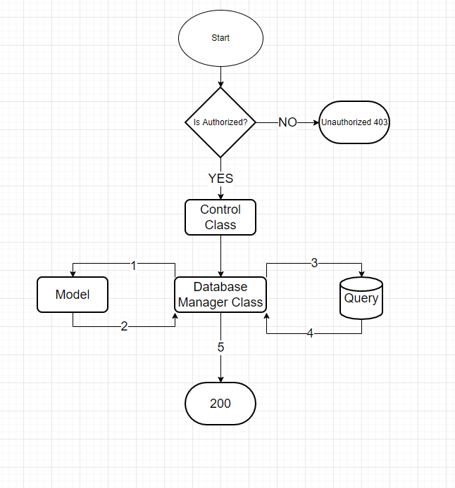
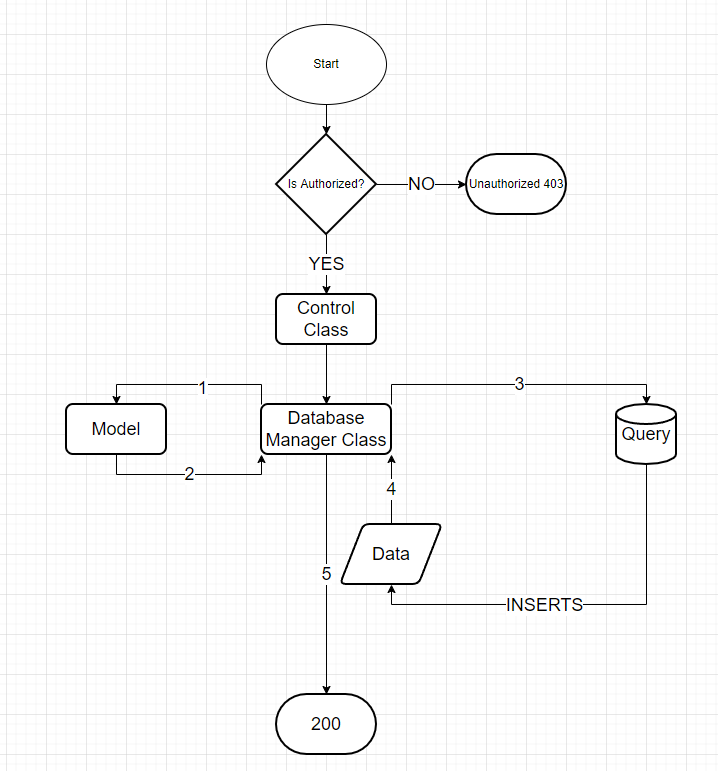

This project is a coding challenge for a company called BlueStorm Software, you can find more on them on the website: https://www.bluestorm.com.br/

Objectives: 
The project objective was to create a working server that could get information about patients, pharmacies and transactions. You can read more about the challenge on [here](documentation/bluestorm_projeto_backend.pdf).

How it Works:
Although the project only defined 3 searches, i decided to do a lot more than that. Let me start by the simple, no authorization ones:

- / : Is the Hello World of the server, very useful to see if the server is actually working fine
- /help: General help, tells you a little bit about server functionality
- /{table-name}/help : Specific help, tells you about how you can use the methods of that table
- /sdk : returns information refering to the SDK, like what version it is expecting

SEARCH METHODS:

All the search methods follow this basic structure:



At first it verifies if you are authorized. From there it goes to a Control class, then to Database Manager Class, from there it comunicates with the Model Classes, gets the information from the database, organizes it and then returns. All the Search Methods are GETs

- /patients : Gets information about the patients. To work it needs
  - headers
    - username: Your username
    - password: Your password
  - query strings (optional, will filter your search)
    - first_name: First name of the patient
    - last_name: Last name of the patient
    - date_of_birth: Date of birth of the patient
    - uuid: patient uuid
- /pharmacies : Gets information about pharmacies. To work it needs
  - headers
    - username: Your username
    - password: Your password
  - query strings (optional, will filter your search)
    - name: pharmacy name
    - city: pharmacy city
    - uuid: pharmacy uuid
- /transactions : Gets information about transactions. To work it needs
  - headers
    - username: Your username
    - password: Your password
  - query strings (optional, will filter your search)
    - patient_first_name: patient name
    - patient_last_name: patient last name
    - patient_birthday: patient date of birth
    - patient_uuid: patient uuid
    - pharmacy_name: pharmacy name
    - pharmacy_city: pharmacy city
    - pharmacy_uuid: pharmacy uuid
    - transaction_amount: transaction amout
    - transaction_timestamp: transaction timestamp
    - transaction_uuid: transaction uuid

INSERT METHODS:

Similar to the search Methods, the Insert Methods work by using the same basic structure:



It verifies if you are authorized, if you are, it goes to a Control class, then to a Database Manager Class, it gets the query from the model and then inserts the data in the database, what you get in return is the row you inserted, with the uuid. The Insert Methods are POST methods, all of theirs atributes are obligatory.

- /patients/insert : Inserts a new patient. To work it needs:
  - headers
    - username: Your username
    - password: Your password
  - body
    - first_name: Patient's first name
    - last_name: Patient's last name
    - date_of_birth: Patient's date of birth
- /pharmacies/insert : Inserts a new pharmacy. To work it needs:
  - headers
    - username: Your username
    - password: Your password
  - body
    - name: pharmacy's name
    - city: pharmacy's city
-  /transactions/insert: Inserts a new Transaction
  - headers
    - username: Your username
    - password: Your password
  - body
    - patient_uuid: Patient's UUID
    - pharmacy_uuid: Pharmacy's UUID
    - amount: Transaction Amount
    - timestamp: Transaction Timestamp


How can you run this application:

The best way to run your application is via a docker container, it also tests your code to verify integrity. You can run it with the code below:

```bash
docker build -t bluestorm/server .
docker run -p 5000:5000 -e host='0.0.0.0' -e port=5000 -e debug=0 -e reloader=0 bluestorm/server
```
How can you test this application:

In the /tools section you will find 2 ways of testing the application. The first one is the SDK, it works in a very simple manner:

1. Import the SDK
2. Create a new instance of the class
3. Use the methods available to make searches or insertions

The SDK has 4 functions:

- test() : Tests the connection, returns true if can connect
- check_sdk(): Checks if the server you are trying to connect expects your version of the SDK
- select(table, filters): Use to make searches to the server
- insert(table, parameters): Use to make insertions to the server

You can find a code snippet bellow:

```python
from sdk import SDK as server_sdk

conn = server_sdk('http://localhost:5000', 'admin', 'admin')
patient = conn.select('patients', {'first_name': 'JOANA'})
print(patient)

new_pharmacy = conn.insert('pharmacies', {'name': 'DROGARIAS PACHECO', 'city': 'RIO GRANDE DO NORTE'})
print(new_pharmacy)

check_pharmacy = conn.select('pharmacies', {'uuid': new_pharmacy['data']['uuid']})
print(check_pharmacy)
```

You can also use the executable app by doing this:

```bash
chmod +x sv_exec.py
./sv_exec.py
./sv_exec.py config --url 'http://localhost:5000/' --username admin --password admin
./sv_exec.py patients -m select -fn JOANA
./sv_exec.py transactions -m insert --patient-uuid 'PATIENT0001' --pharmacy-uuid 'PHARM0001' --amount 102 --timestamp '1980-07-23 00:00:00.000000'
```

If you need more information you can find me through the channels:
Email: matheuscerqueir@gmail.com
Telegram: @osorio

Hope you like it


